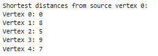
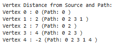
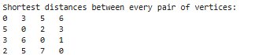

# HandsOn_14

# Problem 1

* Code for Dijkstra's algorithm is given [`Dijkstra.py`](Dijkstra.py)

 

 
 

# Problem 2

* Code for BellmanFord is given [`BellmanFord.py`](BellmanFord.py)

 

 
 

# Problem 3

* Code for Flyod-Warshall is given [`FloydWarshall.py`](FloydWarshall.py)

 

